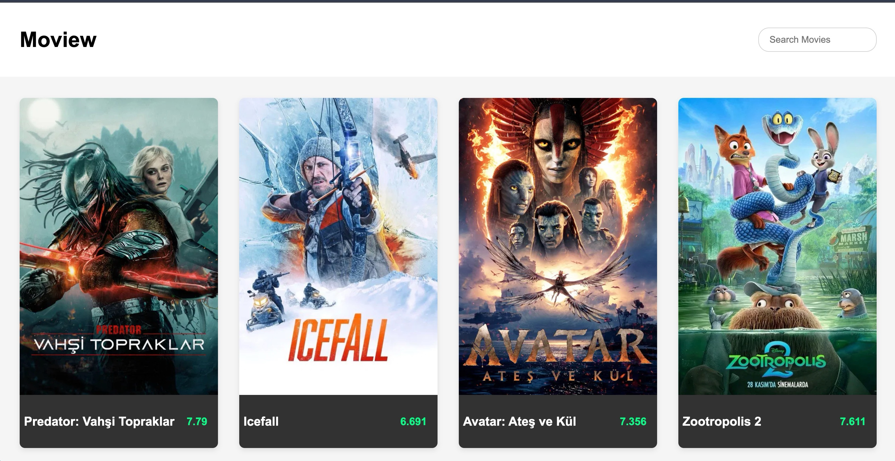

 🎬 Movie App

Movie App, **The Movie Database (TMDb) API** kullanarak popüler filmleri listeleyen ve kullanıcıların film araması yapmasına imkan veren basit bir web uygulamasıdır.  

 ⚡ Özellikler
- 🍿 Popüler filmleri listeleme  
- 🔍 Film arama özelliği  
- 🎨 Film puanına göre renkli etiketleme:
  - 🟢 Yeşil: 8 ve üzeri  
  - 🟠 Turuncu: 5-7.9  
  - 🔴 Kırmızı: 5’in altında  
- 📝 Film detay özetini gösterme  
- 🖼 Poster resmi olmayan filmler için placeholder  

---

🛠️ Kullanılan Teknolojiler
- 💻 HTML, CSS, JavaScript (Vanilla JS)  
- 🌐 Fetch API  
- 🎥 TMDb API  

📷

 

